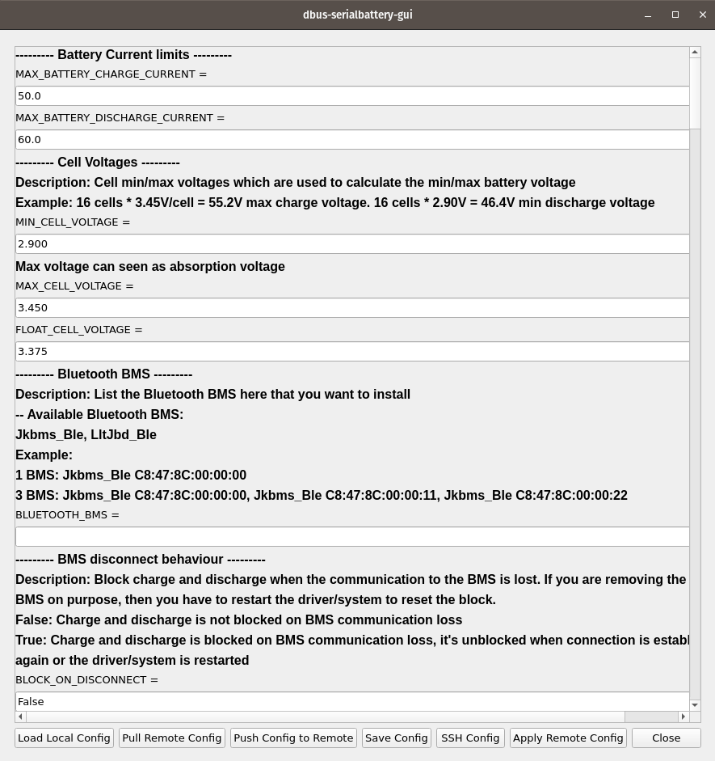

#dbus-serialbattery-gui

This is a graphical user interface (GUI) for configuring and managing dbus-serialbattery https://louisvdw.github.io/dbus-serialbattery/

Table of Contents
- Features
- Installation
- Usage
- Screenshots
- Contributing
- License

Features

- Load and edit local configuration files.
- Pull configuration files from a remote host.
- Push local configuration files to a remote host.
- Configure SSH settings for remote file operations.
- Restart dbus-serialbattery remotely.

Installation

Prerequisites

Before you begin, ensure you have met the following requirements:

- Python 3.x installed on your system.
- PyQt5 library installed (pip install PyQt5).
- Paramiko library installed (pip install paramiko).

Steps

1. Clone the repository to your local machine:

   git clone https://github.com/yourusername/dbus-serialbattery-gui.git

2. Navigate to the project directory:

   cd dbus-serialbattery-gui

3. Run the application:

   python your_app_name.py

   Replace your_app_name.py with the name of your main Python script.

Usage

1. Launch the application by running the script.

2. Use the provided buttons to load, edit, and manage configuration files.

3. Configure SSH settings for remote file operations by clicking the "SSH Config" button.

4. Restart dbus-serialbattery remotely by clicking the "Restart dbus-serialbattery" button.

License

This project is licensed under the MIT License - see the LICENSE file for details.
